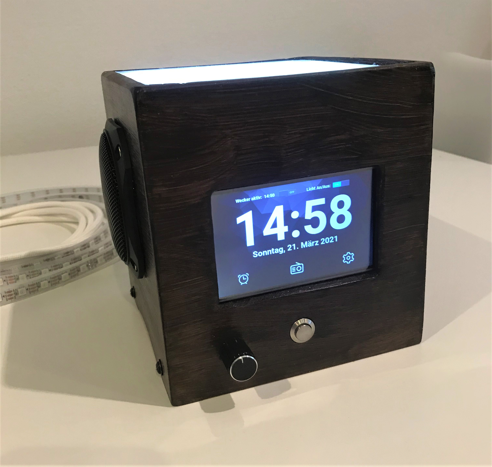
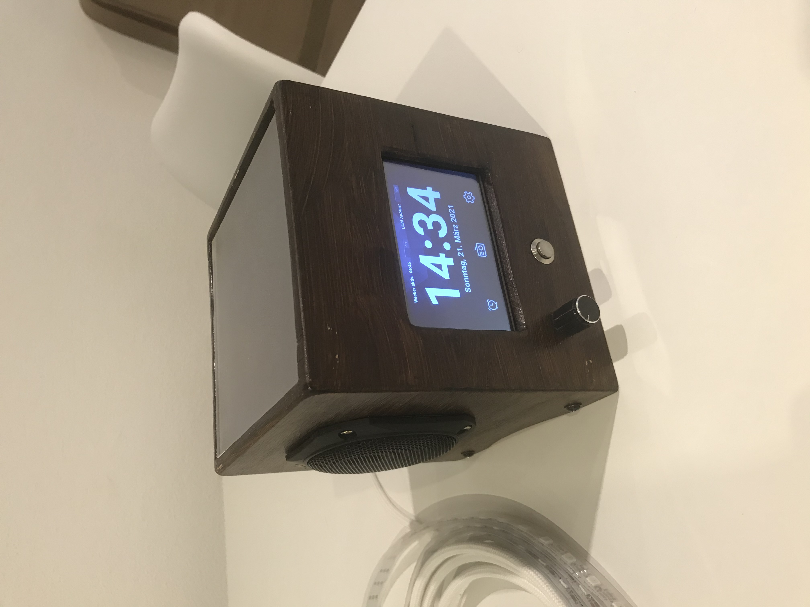
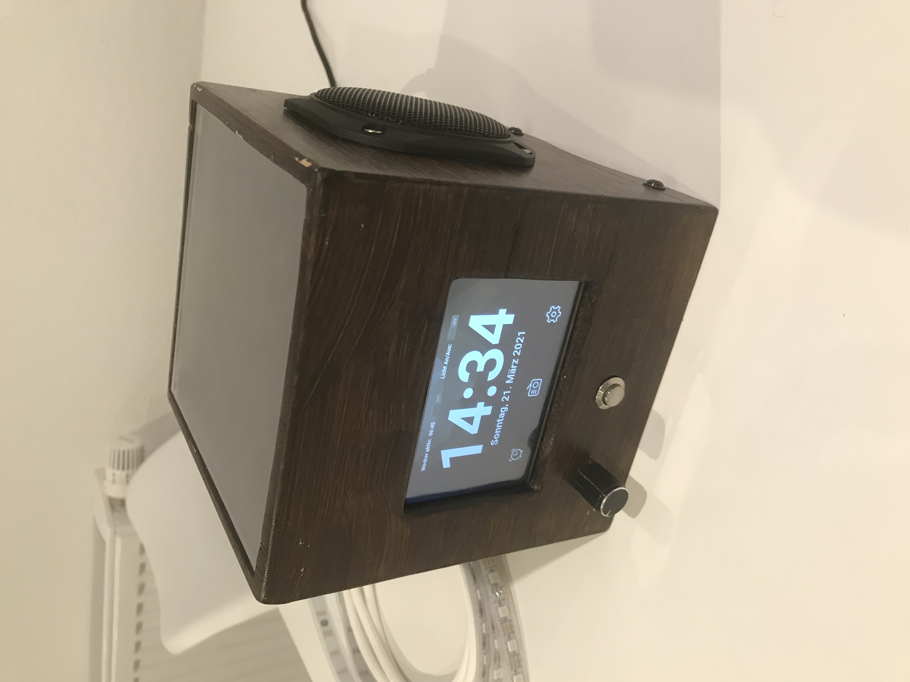

# Light Alarm Clock

### DIY light alarm Clock. Based on a raspberry pi & arduino nano. Totally over engineered and way to expensive - but i dont care! 
##### Feel free to use some code or build it for yourself! :)

  
  

#### Documentation:
 1. [Hardware](documentation/1_hardware.md)
 2. [Software architecture](documentation/2_softwareArchitecture.md)
 3. [Internet Radio](documentation/3_internetRadio)
 4. [Alarm clock](documentation/4_alarmClock)
 5. [hifiberry amp2 with alsa equalizer](documentation/5_soundcard.md) 
 6. [Kivy GUI](documentation/6_kivyGui.md)
 7. [Touchdisplay](documentation/7_touchdisplay)
 8. [Arduino](documentation/8_0_arduino)

	8.1. [Raspberry Pi serial connection](documentation/8_1_serialConnection)
	8.2. [LED Stripe WS2812b](documentation/8_2_ledStripe)
	8.3. [GPIO Encoder / Button](documentation/8_3_gpio)

 9. [VNC Client](documentation/vncClient)
 10. [Bluetooth speaker with pulseaudio](documentation/bluetoothSpeaker)
 11. [HTTP/REST API](documentation/11_restAPI)

### Videos:
